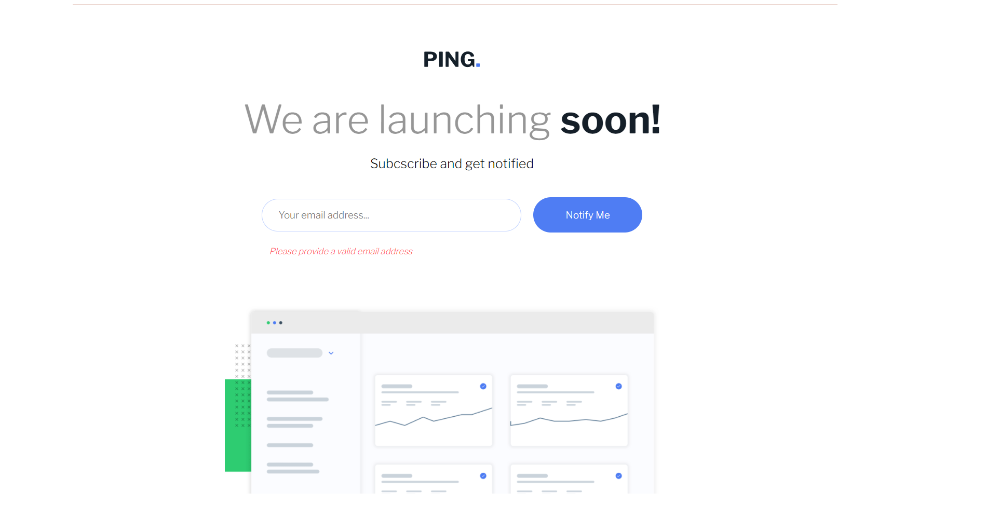
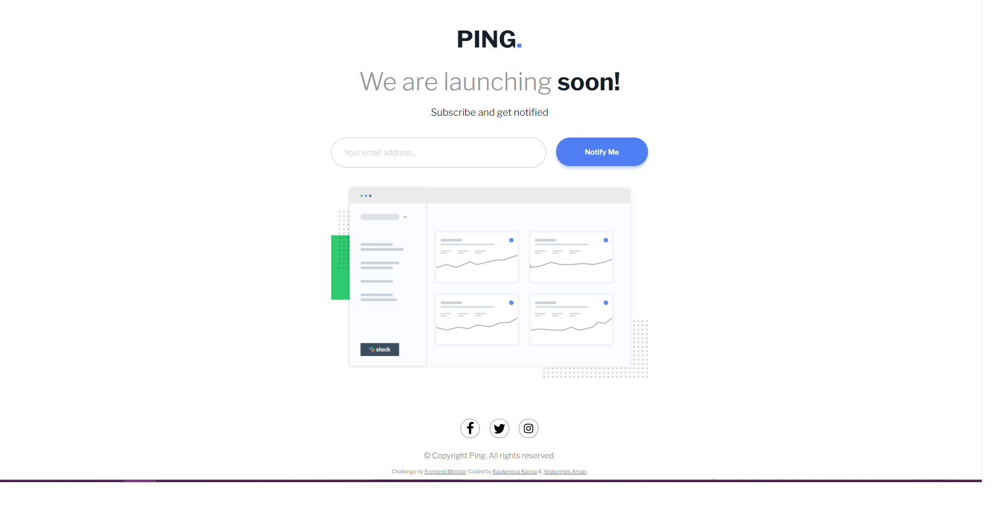

# Frontend Mentor - Ping coming soon page solution

This is the first joint beginning work of Kaukenova Karina and Yeskermes Aman.
To begin with, we want to thank you for checking and evaluating our page.
We used basic understanding of HTML, CSS, JavaScript to write this work.

This is a solution to the [Ping coming soon page challenge on Frontend Mentor](https://www.frontendmentor.io/challenges/ping-single-column-coming-soon-page-5cadd051fec04111f7b848da). Frontend Mentor challenges help you improve your coding skills by building realistic projects. 

## Table of contents

- [Overview](#overview)
  - [The challenge](#the-challenge)
  - [Screenshot](#screenshot)
- [My process](#my-process)
  - [Built with](#built-with)
  - [What I learned](#what-i-learned)
  - [Useful resources](#useful-resources)
- [Author](#author)
- [Acknowledgments](#acknowledgments)

## Overview

### The challenge

Users should be able to:

- See hover states for all interactive elements on the page
- Submit their email address using an `input` field
- Receive an error message when the `form` is submitted if:
	- The `input` field is empty. The message for this error should say *"Whoops! It looks like you forgot to add your email"*
	- The email address is not formatted correctly (i.e. a correct email address should have this structure: `name@host.tld`). The message for this error should say *"Please provide a valid email address"*

### Screenshot

This is a screenshot of our solution.




## My process

### Built with

- Semantic HTML5 markup
- CSS custom properties
- JavaScript

### What We learned
We have learned how to use all these tools correctly. How to correctly prioritize when compiling a website. You can see important examples below.

Snippets:

```html
<h1>Some HTML code I'm proud of</h1>
<ul class="social_networks">
        <li><a href="#"></a></li>
        <li><a href="#"></a></li>
          <li><a href="#"></a></li>
      </ul>
```
```css
.proud-of-this-css:
  button {
  color: white;
  background-color: hsl(223, 87%, 63%);
  border-radius: 50px;
  box-shadow: 0 5px 5px hsl(223, 100%, 88%);
  font-size: 15px;
  font-family: 'Libre Franklin', sans-serif;
  font-weight: 550;
  padding: 20px 0;
  margin-left: 20px;
  flex: 0.3;
  cursor: pointer;
}
```
```js
//email format validation pattern//
function validate() {
  let value = input.value;
  const pattern = /^[^ ]+@[^ ]+\.[a-z]{2,3}$/;
  if (value.match(pattern)) return true;
  else return false;
}
```
### Useful resources

- [Fonts Google](https://fonts.google.com/specimen/Libre+Franklin) - This helped us for changing fonts of our text.

## Author
- Karina Kaukenova: [@kar11nko](https://github.com/kar11nko)
- Yeskermes Aman:  [@Yeskermes](https://github.com/Yeskermes)

## Acknowledgments

I want to thank Aman for his help. As they say, teamwork makes a dreamwork! We solved everything together.
**Note: Delete this note and edit this section's content as necessary. If you completed this challenge by yourself, feel free
